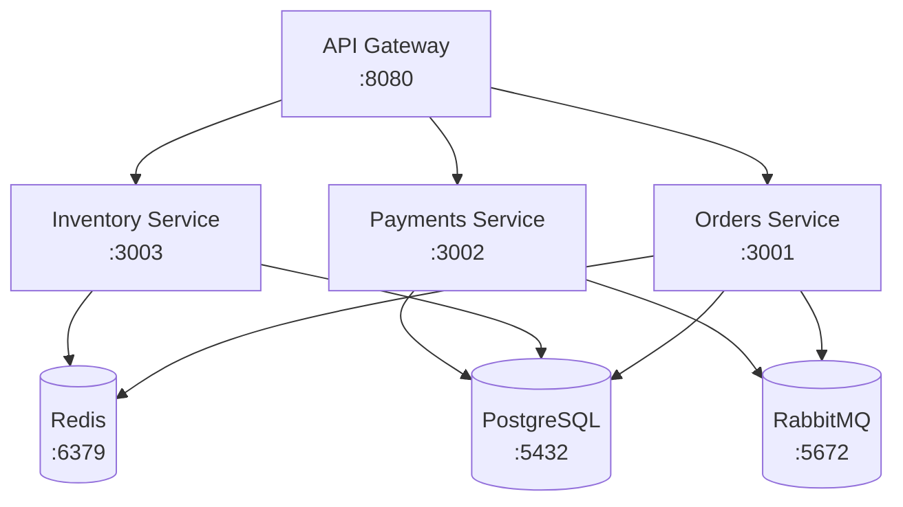
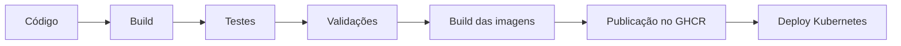
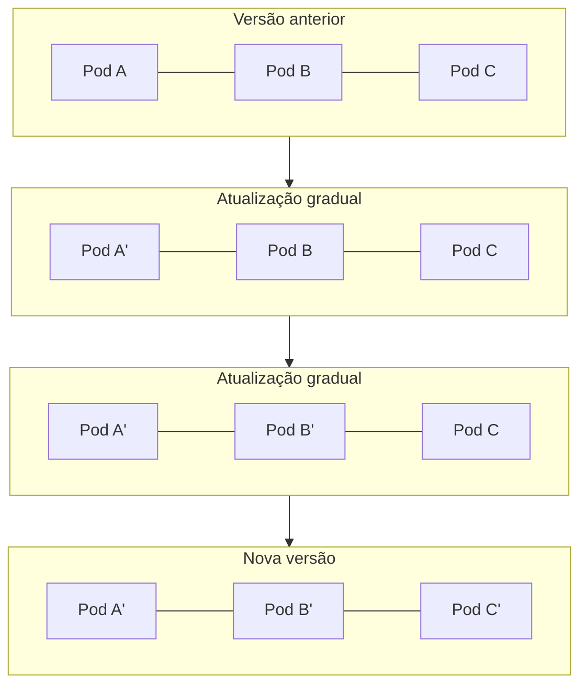
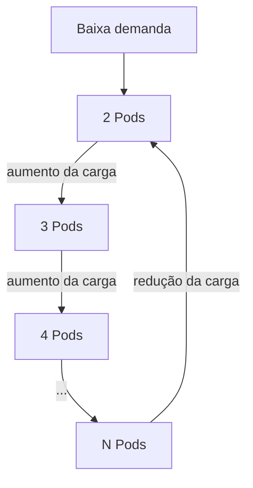
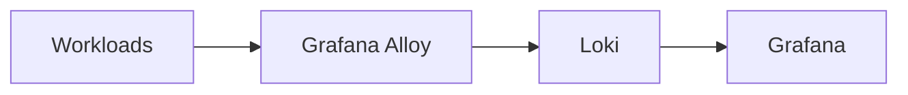
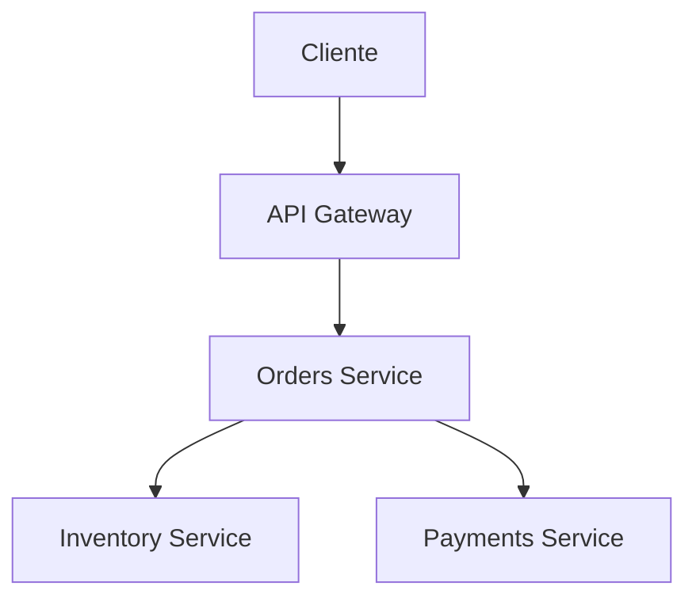

# 🚀 Pedidos Veloz

Sistema distribuído de gerenciamento de pedidos desenvolvido com arquitetura de microsserviços, utilizando Docker Compose para execução local e Kubernetes para implantação, observabilidade e escalabilidade.

<p>
  
  
  
  
</p>

## 📑 Sumário

- [Visão Geral](#-visão-geral)
- [Arquitetura](#️-arquitetura)
- [Ambiente Local com Docker Compose](#-ambiente-local-com-docker-compose)
- [Conteinerização](#-conteinerização)
- [Kubernetes](#️-kubernetes)
- [CI/CD](#-cicd)
- [Estratégia de Deploy](#-estratégia-de-deploy)
- [Estratégia de Escalabilidade](#-estratégia-de-escalabilidade)
- [Observabilidade](#-observabilidade)
- [Estrutura do Projeto](#-estrutura-do-projeto)
- [Validação Kubernetes](#-validação-kubernetes)
- [Segurança](#-segurança)
- [Atendimento aos Requisitos](#-atendimento-aos-requisitos)
- [Conclusão](#-conclusão)
- [Licença](#-licença)
- [Autor](#-autor)

---

## 📋 Visão Geral

O **Pedidos Veloz** é composto por múltiplos serviços independentes que se comunicam por HTTP e mensageria.

A arquitetura possui:

- API Gateway
- Orders Service
- Inventory Service
- Payments Service
- PostgreSQL
- Redis
- RabbitMQ

O projeto pode ser executado localmente utilizando Docker Compose e implantado em um cluster Kubernetes.

---

## 🏗️ Arquitetura



---

## 🐳 Ambiente Local com Docker Compose

### Requisitos

Antes de executar o projeto, instale:

- [Docker](https://docs.docker.com/get-docker/)
- [Docker Compose](https://docs.docker.com/compose/)
- [Git](https://git-scm.com/)
- Node.js 20 ou superior
- Python 3.14 ou superior

Verifique as versões:

```bash
node --version
python --version
docker --version
docker compose version
git --version
```

### Instalação Local

**1. Clonar o repositório**

```bash
git clone https://github.com/Devan-M/pedidos-veloz.git
cd pedidos-veloz
```

**2. Configurar variáveis de ambiente**

Crie o arquivo `.env` a partir do arquivo de exemplo:

```bash
cp .env.example .env
```

Configure os valores necessários no arquivo `.env`.

> ⚠️ O arquivo `.env` contém informações sensíveis e não deve ser versionado no Git.

**3. Iniciar a aplicação**

Toda a arquitetura pode ser iniciada utilizando um único comando:

```bash
docker compose up -d
```

O Docker Compose inicia:

- API Gateway
- Orders Service
- Inventory Service
- Payments Service
- PostgreSQL
- Redis
- RabbitMQ

**4. Verificar os serviços**

```bash
docker compose ps
```

Para acompanhar os logs:

```bash
docker compose logs -f
```

Para visualizar os logs de um serviço específico:

```bash
docker compose logs -f orders-service
```

**5. Parar a aplicação**

```bash
docker compose down
```

Os dados persistentes permanecem nos volumes Docker configurados.

### 🌐 Serviços e Portas

| Serviço              | Porta |
|----------------------|-------|
| API Gateway          | 8080  |
| Orders Service       | 3001  |
| Payments Service     | 3002  |
| Inventory Service    | 3003  |
| PostgreSQL           | 5432  |
| Redis                | 6379  |
| RabbitMQ             | 5672  |
| RabbitMQ Management  | 15672 |

### 💾 Redes e Volumes

O Docker Compose utiliza uma rede dedicada para comunicação entre os serviços:

- `pedidos-network`

Volumes persistentes utilizados:

- `postgres_data`
- `redis_data`
- `rabbitmq_data`

Os volumes permitem preservar os dados dos serviços de infraestrutura mesmo quando os containers são recriados.

---

## 📦 Conteinerização

Cada serviço de aplicação possui seu próprio `Dockerfile`.

Estrutura:

```text
services/
├── api-gateway/
│   ├── Dockerfile
│   └── .dockerignore
├── inventory-service/
│   ├── Dockerfile
│   └── .dockerignore
├── orders-service/
│   ├── Dockerfile
│   └── .dockerignore
└── payments-service/
    ├── Dockerfile
    └── .dockerignore
```

### Multi-stage Build

Os serviços utilizam builds multi-stage quando aplicável.

- Os serviços Node.js utilizam uma etapa de construção para instalação das dependências e uma imagem separada para execução.
- O serviço de pagamentos utiliza uma etapa de build para instalação das dependências Python e uma imagem de runtime separada.

Essa abordagem reduz o conteúdo desnecessário presente na imagem final e separa o processo de construção do ambiente de execução.

### Segurança dos Containers

Os serviços de aplicação são executados com usuários não-root.

Exemplos:

```dockerfile
USER nodejs
```

```dockerfile
USER appuser
```

Também são utilizadas imagens base enxutas, como:

- `node:20-alpine`
- `python:3.14-slim`

Os arquivos `.dockerignore` impedem que conteúdos desnecessários ou sensíveis sejam enviados para o contexto de build, entre eles:

- `.git`
- `.env`
- `.env.local`
- `node_modules`
- `coverage`
- `dist`
- `build`

### 🏷️ Versionamento das Imagens

As imagens dos serviços são publicadas no **GitHub Container Registry (GHCR)**.

As tags utilizam a branch e o commit responsável pela construção da imagem.

Exemplo:

```text
ghcr.io/devan-m/pedidos-veloz/orders-service:main-04ba594
```

Esse modelo permite relacionar diretamente uma imagem Docker ao commit correspondente no repositório.

---

## ☸️ Kubernetes

Os manifests Kubernetes estão organizados no diretório `k8s/`.

A configuração utiliza **Kustomize** para organização dos recursos.

Principais recursos utilizados:

- Deployments
- Services
- ConfigMaps
- Secrets
- HorizontalPodAutoscalers
- Network Policies
- Readiness Probes
- Liveness Probes
- Security Contexts

### Deployments

Os serviços de aplicação são executados através de Kubernetes Deployments.

Principais workloads:

- `api-gateway`
- `orders-service`
- `inventory-service`
- `payments-service`

Os componentes de infraestrutura também possuem seus respectivos recursos Kubernetes.

### Services

Os Kubernetes Services fornecem comunicação estável entre os Pods e permitem a descoberta dos serviços através do DNS interno do cluster.

### 🔐 ConfigMaps e Secrets

Configurações não sensíveis podem ser armazenadas em ConfigMaps.

Informações sensíveis são armazenadas através de Kubernetes Secrets.

> ⚠️ Credenciais não devem ser armazenadas diretamente nos manifests versionados.

Arquivos locais contendo informações sensíveis, como:

- `.env`
- `k8s/base/secret.env`

não são versionados no Git — esses arquivos são protegidos através do `.gitignore`.

### ❤️ Readiness e Liveness Probes

Os serviços utilizam mecanismos de verificação de saúde quando aplicável.

As probes permitem ao Kubernetes:

- identificar quando um Pod está pronto para receber tráfego;
- detectar containers que não estão respondendo corretamente;
- retirar Pods não prontos do balanceamento;
- reiniciar containers que apresentem falhas persistentes.

A `readinessProbe` é especialmente importante durante atualizações *Rolling Update*, pois evita que um Pod seja considerado disponível antes de estar preparado para receber requisições.

### 🛡️ Segurança Kubernetes

O projeto utiliza mecanismos de segurança do Kubernetes, incluindo:

- Pod Security Admission (PSA)
- Security Contexts
- `runAsNonRoot`
- `seccompProfile`
- Network Policies
- RBAC
- Kubernetes Secrets

Os containers são executados sem privilégios administrativos desnecessários.

O perfil `RuntimeDefault` é utilizado através do `seccompProfile`.

As Network Policies restringem a comunicação entre workloads conforme as necessidades da arquitetura.

---

## 🔄 CI/CD

O projeto utiliza **GitHub Actions** para automatizar o ciclo de integração contínua e entrega.

Os workflows estão em `.github/workflows/`:

- `.github/workflows/build.yml`
- `.github/workflows/deploy.yml`

O pipeline realiza etapas como:

- validação da configuração;
- execução dos testes automatizados;
- validação dos manifests Kubernetes;
- build das imagens Docker;
- publicação das imagens no GitHub Container Registry;
- deploy automatizado no Kubernetes.

**Fluxo simplificado:**



### Build

O pipeline realiza o build das aplicações e das respectivas imagens Docker.

Os Dockerfiles dos serviços utilizam estratégias multi-stage quando aplicável.

### Testes

São executados testes automatizados durante o processo de CI.

Os serviços possuem testes específicos executados pelo pipeline antes da publicação das imagens.

### Validações

O pipeline também realiza validações básicas da infraestrutura Kubernetes, incluindo validação da configuração dos manifests.

O objetivo é impedir que configurações inválidas sejam utilizadas no processo de deploy.

### Publicação de Imagens

Após as etapas de validação, as imagens Docker são publicadas no **GitHub Container Registry (GHCR)**.

As imagens recebem tags associadas ao commit. Exemplo:

```text
main-04ba594
```

Isso fornece rastreabilidade entre código-fonte e artefato publicado.

### Secrets no CI/CD

Informações sensíveis utilizadas pelo pipeline são fornecidas através dos mecanismos de Secrets do GitHub Actions.

Secrets não são armazenados diretamente no código-fonte.

Quando arquivos temporários são utilizados durante o deploy, eles são removidos ao final da execução através de uma etapa de limpeza executada mesmo quando ocorre falha.

---

## 🔄 Estratégia de Deploy

O projeto utiliza **Rolling Update** como estratégia de implantação no Kubernetes.

A estratégia substitui gradualmente os Pods da versão anterior pelos Pods da nova versão.



A escolha do Rolling Update é adequada ao projeto porque:

- utiliza recursos nativos dos Deployments;
- reduz a possibilidade de indisponibilidade;
- não exige infraestrutura duplicada;
- permite substituição gradual dos Pods;
- pode utilizar readiness probes para controlar quando novos Pods recebem tráfego.

---

## 📈 Estratégia de Escalabilidade

O projeto utiliza **Horizontal Pod Autoscaler (HPA)** para realizar escalabilidade horizontal.

Possuem HPA os seguintes serviços:

- API Gateway
- Inventory Service
- Orders Service
- Payments Service

Os HPA utilizam métricas de:

- CPU
- memória

O número de réplicas é ajustado automaticamente conforme a utilização dos recursos.



Quando a demanda diminui, o HPA pode reduzir novamente a quantidade de réplicas até o limite mínimo configurado.

### Por que HPA?

O HPA foi escolhido porque o principal requisito de escalabilidade do projeto é aumentar ou reduzir horizontalmente a quantidade de instâncias dos serviços.

Essa estratégia permite:

- absorver aumento de carga;
- melhorar disponibilidade;
- distribuir requisições entre múltiplos Pods;
- reduzir consumo de recursos quando a demanda diminui.

O VPA não é utilizado como mecanismo principal porque o projeto prioriza a alteração da quantidade de Pods, e não o ajuste automático dos recursos individuais de cada Pod.

---

## 📊 Observabilidade

A arquitetura possui uma camada de observabilidade baseada em:

- Prometheus
- Grafana
- Grafana Alloy
- Loki
- Jaeger

A estratégia contempla três pilares principais: **métricas**, **logs** e **traces**.

### Métricas

O Prometheus é utilizado para coleta e armazenamento de métricas.

Entre os indicadores acompanhados estão:

- utilização de CPU;
- utilização de memória;
- disponibilidade dos Pods;
- estado dos workloads;
- métricas utilizadas pelo HPA;
- métricas de aplicação quando disponibilizadas pelos serviços.

### Dashboards

O Grafana é utilizado para visualização das métricas e construção de dashboards, permitindo acompanhar o estado da aplicação e da infraestrutura.

### Logs

O projeto utiliza o fluxo:



O Grafana Alloy realiza a coleta dos logs dos workloads e o Loki atua como backend de armazenamento e consulta. Essa arquitetura centraliza os logs e facilita a investigação de falhas.

### 🔎 Tracing Distribuído

O projeto utiliza **Jaeger** como componente destinado ao tracing distribuído, permitindo acompanhar uma requisição ao longo dos diferentes serviços:



O tracing distribuído permite identificar:

- latência;
- gargalos;
- falhas;
- dependências entre serviços;
- tempo gasto em cada etapa da requisição.

A instrumentação pode ser expandida conforme a evolução dos serviços.

### Acessando as ferramentas de observabilidade

| Ferramenta      | Endereço                                      | Função                                                        |
|------------------|-----------------------------------------------|----------------------------------------------------------------|
| **Prometheus**   | [http://localhost:9090](http://localhost:9090) | Coleta e armazenamento de métricas                             |
| **Grafana**      | [http://localhost:3000](http://localhost:3000) | Visualização de métricas, dashboards e consulta aos logs       |
| **Loki**         | —                                              | Backend de armazenamento e consulta dos logs do Grafana Alloy  |
| **Grafana Alloy**| —                                              | Coleta e encaminhamento dos logs dos workloads                 |
| **Jaeger**       | —                                              | Tracing distribuído                                             |

---

## 📁 Estrutura do Projeto

```text
pedidos-veloz/
│
├── .github/
│   └── workflows/
│       ├── build.yml
│       └── deploy.yml
│
├── k8s/
│   ├── base/
│   ├── security/
│   └── observability/
│
├── services/
│   ├── api-gateway/
│   ├── inventory-service/
│   ├── orders-service/
│   └── payments-service/
│
├── docker-compose.yml
├── .env.example
├── .gitignore
└── README.md
```

---

## 🧪 Validação Kubernetes

Para validar os manifests sem realizar alterações no cluster:

```bash
kubectl apply --dry-run=client -k k8s/base
```

Para verificar os Deployments:

```bash
kubectl get deployments -n pedidos-veloz
```

Para verificar os Pods:

```bash
kubectl get pods -n pedidos-veloz
```

Para verificar os Services:

```bash
kubectl get services -n pedidos-veloz
```

Para verificar os HPA:

```bash
kubectl get hpa -n pedidos-veloz
```

Para verificar as métricas:

```bash
kubectl top pods -n pedidos-veloz
```

---

## 🔒 Segurança

O projeto adota práticas de segurança em diferentes camadas:

- containers executados como não-root;
- imagens base enxutas;
- `.dockerignore`;
- Secrets do Kubernetes;
- Secrets do GitHub Actions;
- Network Policies;
- Pod Security Admission;
- `seccompProfile: RuntimeDefault`;
- RBAC;
- redução de privilégios dos containers;
- exclusão de arquivos temporários contendo informações sensíveis.

Arquivos locais contendo credenciais não são versionados:

- `.env`
- `.env.local`
- `k8s/base/secret.env`

---

## 📋 Atendimento aos Requisitos

| Requisito                            | Implementação             |
|---------------------------------------|----------------------------|
| Ambiente local com Docker Compose     | ✅ |
| Arquitetura multi-serviço funcional   | ✅ |
| Serviços iniciados com um único comando | ✅ `docker compose up -d` |
| Redes                                 | ✅ |
| Volumes persistentes                  | ✅ |
| Variáveis de ambiente                 | ✅ |
| Instruções claras no README           | ✅ |
| Dockerfiles estruturados              | ✅ |
| Multi-stage build                     | ✅ |
| Versionamento das imagens             | ✅ |
| Containers não-root                   | ✅ |
| Dependências mínimas                  | ✅ |
| Kubernetes                            | ✅ |
| Deployments                           | ✅ |
| Services                              | ✅ |
| ConfigMaps                            | ✅ |
| Secrets                               | ✅ |
| Readiness probes                      | ✅ |
| Liveness probes                       | ✅ |
| Pod Security Admission                | ✅ |
| Network Policies                      | ✅ |
| RBAC                                  | ✅ |
| CI/CD automatizado                    | ✅ |
| Build                                 | ✅ |
| Testes                                | ✅ |
| Publicação de imagens                 | ✅ GHCR |
| Secrets no pipeline                   | ✅ |
| Validações básicas                    | ✅ |
| Métricas                              | ✅ Prometheus |
| Dashboards                            | ✅ Grafana |
| Logs                                  | ✅ Alloy + Loki |
| Tracing distribuído                   | ✅ Jaeger |
| Estratégia de deploy                  | ✅ Rolling Update |
| Escalabilidade                        | ✅ HPA |

---

## 📚 Conclusão

O **Pedidos Veloz** apresenta uma arquitetura baseada em microsserviços que atende aos requisitos de execução local, conteinerização, Kubernetes, CI/CD, observabilidade, estratégia de deploy e escalabilidade.

A solução utiliza:

- Docker Compose para ambiente local;
- Dockerfiles multi-stage;
- containers executados como não-root;
- versionamento de imagens por commit;
- Kubernetes para implantação;
- ConfigMaps e Secrets;
- readiness e liveness probes;
- Pod Security Admission;
- Network Policies;
- RBAC;
- GitHub Actions;
- GitHub Container Registry;
- Prometheus;
- Grafana;
- Grafana Alloy;
- Loki;
- Jaeger;
- Rolling Update;
- Horizontal Pod Autoscaler.

---

## 📝 Licença

Distribuído sob a licença **MIT**.

## 👨‍💻 Autor

**Devan M**

GitHub: [github.com/Devan-M/pedidos-veloz](https://github.com/Devan-M/pedidos-veloz)
